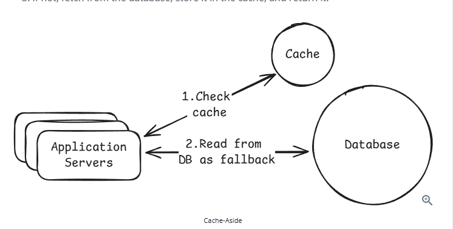
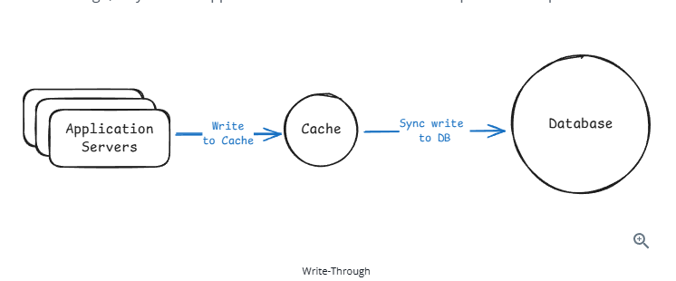
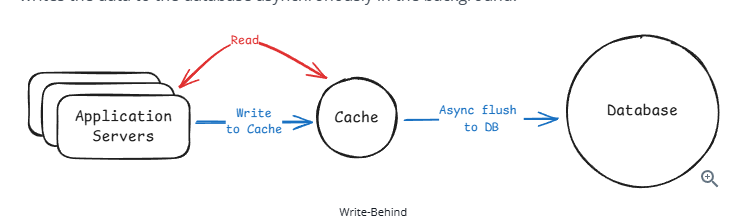
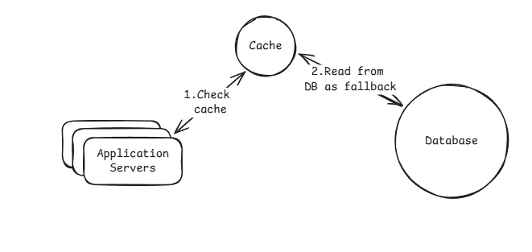

# Caching — Revision Notes

> Source: https://www.hellointerview.com/learn/system-design/core-concepts/caching

---

## Why Cache?

- Reading from Postgres: ~50ms. Reading from Redis: ~1ms. That's a **50x latency improvement**.
- Databases hit disk on every query; in-memory caches skip that entirely.
- Caches reduce database load and cut latency — but introduce complexity around **invalidation** and **failure handling**.

---

## Where to Cache

### 1. External Cache (Redis / Memcached)
- Standalone cache service your app talks to over the network.
- All app servers share the same cache — scales well.
- Supports eviction policies (LRU) and TTL expiration.
- **Default answer in interviews** for high-traffic systems.

### 2. CDN (Content Delivery Network)
- Geographically distributed edge servers cache content close to users.
- Examples: Cloudflare, Fastly, Akamai.
- **How it works:** Request hits nearest edge → cache hit returns instantly; cache miss fetches from origin, stores, then returns.
- Without CDN (Virginia origin → India user): 250–300ms. With CDN: 20–40ms.
- **Best used for:** Static media (images, videos) at scale.
- Modern CDNs can also cache API responses and HTML pages, but mention that only if the problem calls for it.

### 3. Client-Side Cache
- Browser (HTTP cache, localStorage) or mobile app local storage.
- Also includes client library metadata caches (e.g. Redis client caches cluster topology).
- Limited backend control; invalidation is harder; data can go stale.

### 4. In-Process Cache
- Data cached directly in application server memory — no network call at all.
- Even faster than Redis.
- **Good for:** Config values, feature flags, small reference datasets, hot keys, rate limiting counters, precomputed values.
- **Limitation:** Each server instance has its own cache — not shared across servers. One instance invalidating a value doesn't notify others.
- **Use as:** An optimization layer *after* introducing an external cache. Mention in interviews only for extremely hot keys.

---

## Cache Architectures (Read/Write Patterns)

### Cache-Aside (Lazy Loading) ⭐ Default
1. App checks cache.
2. **Cache hit** → return data.
3. **Cache miss** → fetch from DB, store in cache, return data.

- Only caches data when needed → lean cache.
- Downside: cache miss adds extra latency.
- **If you remember one pattern, make it this one.**

### Write-Through
- App writes **only to cache**; cache synchronously writes to DB before ack'ing.
- Write doesn't complete until **both** cache and DB are updated.
- Requires specialized caching library (Redis doesn't natively support it).
- **Slower writes** (waits for both); can pollute cache with data never re-read.
- Still has the **dual-write problem** (one side can fail → inconsistency).
- Use when: reads must always return fresh data and slower writes are acceptable.

### Write-Behind (Write-Back)
- App writes **only to cache**; cache **asynchronously** flushes to DB in background.
- **Very fast writes**, but risk of **data loss** if cache crashes before flush.
- Use when: high write throughput needed and eventual consistency is acceptable (e.g. analytics, metrics pipelines).

### Read-Through
- Cache acts as a smart proxy — app never talks to DB directly.
- On a cache miss, **the cache itself** fetches from DB, stores, and returns data.
- Read equivalent of write-through; systems often combine both.
- More complex; requires specialized library.
- **CDNs are a form of read-through cache.**
- Rarely proposed in interviews for app-level caching; cache-aside is preferred.

---

## Cache Eviction Policies

| Policy | How it works | Best for |
|--------|-------------|----------|
| **LRU** (Least Recently Used) | Evicts item not accessed for the longest time | Default for most workloads |
| **LFU** (Least Frequently Used) | Evicts item with the lowest access count | Consistently popular items (trending videos) |
| **FIFO** (First In First Out) | Evicts oldest item by insertion time | Rarely used — ignores usage patterns |
| **TTL** (Time To Live) | Expires keys after a set duration | Combine with LRU/LFU to balance freshness and memory |

- **TTL is not an eviction policy** by itself — it's a freshness mechanism.
- TTL is essential when data *must* eventually refresh (API responses, session tokens).

---

## Common Caching Problems

### 1. Cache Stampede (Thundering Herd)
- Popular cache entry expires → many requests simultaneously miss and hit the DB → DB overload.
- **Example:** Homepage feed TTL expires at 12:01:00 → 1000 concurrent requests all query the DB.
- **Solutions:**
  - **Request coalescing (single flight):** Only one request rebuilds the cache; others wait. *(Most effective)*
  - **Cache warming:** Refresh popular keys proactively before they expire. *(Only helps with TTL-based expiration)*

### 2. Cache Consistency
- Cache and DB return different values for the same data.
- Happens because writes go to DB first while cache still holds stale data.
- **No perfect solution** — choose strategy based on how fresh data must be.
- **Solutions:**
  - **Cache invalidation on writes:** Delete cache entry after DB update; next read repopulates it.
  - **Short TTLs:** Let slightly stale data expire on its own if eventual consistency is acceptable.
  - **Accept eventual consistency:** Fine for feeds, metrics, analytics.

### 3. Hot Keys
- One cache entry receives disproportionately high traffic → overloads a single cache node/shard.
- **Example:** Everyone views Taylor Swift's profile → `user:taylorswift` gets millions of req/s on one Redis node.
- **Solutions:**
  - **Replicate hot keys** across multiple cache nodes and load balance reads.
  - **Add in-process local cache** as a fallback to avoid hammering Redis.
  - **Apply rate limiting** on abusive traffic patterns.

---

## How to Talk About Caching in Interviews

### When to Bring It Up
Don't jump straight to caching — establish **why** it's needed first. Trigger scenarios:

- **Read-heavy workload:** "10M DAU × 20 req/day = 200M DB reads. Cache drops 30–50ms queries to <2ms."
- **Expensive queries:** "Personalized feed = join posts + followers + likes = 200ms. Cache for 60s, serve in 1ms."
- **High DB CPU:** "DB at 80% CPU during peak just serving repeated reads. Caching cuts load 70–80%."
- **Latency requirements:** "Need sub-10ms API response. DB queries take 30–50ms. We have to cache."

### How to Walk Through It (5 Steps)

1. **Identify the bottleneck** — Be specific: what's slow and why?
   > *"User profile queries hit the DB 500 times/sec during peak. Each takes 30ms. That's our bottleneck."*

2. **Decide what to cache** — Frequently read, infrequently changed, expensive to recompute.
   - Think about **cache keys**: `user:123:profile`, `trending:posts:global`
   - Don't cache everything.

3. **Choose your cache architecture** — Match pattern to consistency requirements.
   - Cache-aside is the safe default.
   - Mention CDN for static content; in-process for extremely hot keys.

4. **Set an eviction policy** — LRU is the default. Always explain TTL.
   > *"LRU eviction, TTL of 10 minutes. If user updates profile, we invalidate immediately."*

5. **Address the downsides** — Pick 1–2 relevant problems and explain how you'd handle them:
   - **Invalidation:** Invalidate on write, or rely on TTL.
   - **Cache failure:** Fall back to DB; add circuit breakers; in-process cache as last resort.
   - **Thundering herd:** Probabilistic early expiration or request coalescing for hot keys.

---

