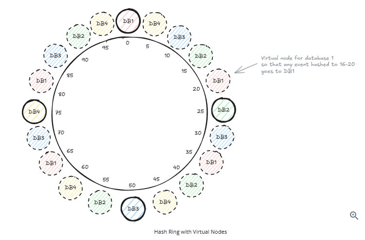

# Consistent Hashing

> Source: https://www.hellointerview.com/learn/system-design/core-concepts/consistent-hashing

---

## The Problem

When sharding data across multiple databases, you need a strategy to decide **which data goes to which node**.

---

## Attempt 1: Simple Modulo Hashing

```
database_id = hash(event_id) % number_of_databases
```

**Example with 3 databases:**
```
Event #1234 → hash(1234) % 3 = 1 → DB1
Event #5678 → hash(5678) % 3 = 0 → DB0
Event #9012 → hash(9012) % 3 = 2 → DB2
```

### Why it fails

| Scenario | Problem |
|---|---|
| **Add a node** | Modulo changes from `% 3` to `% 4` — nearly all keys remap to different nodes → massive data movement |
| **Remove a node** | Modulo changes from `% 3` to `% 2` — same problem, huge redistribution spike |

---

## Attempt 2: Consistent Hashing (The Fix)

### Core Idea — The Hash Ring

1. Create a **circular hash space** (ring) from `0` to `2^32 - 1`
2. Place each **database node** on the ring by hashing its name (e.g., `hash("DB1") → 0`, `hash("DB2") → 25`, etc.)
3. To find which node stores a key: **hash the key → find its position → walk clockwise** to the first node

```
Ring positions (simplified 0-100):
DB1 @ 0,  DB2 @ 25,  DB3 @ 50,  DB4 @ 75
```

### Adding a Node (DB5 @ position 90)

- Only keys hashing to **75–90** need to move (from DB1 → DB5)
- All other keys are untouched
- Data movement: ~15% vs ~100% with modulo hashing

### Removing a Node (DB2 @ position 25 fails)

- Only keys that mapped to DB2 (positions 0–25) need to move → they go to DB3 (@ 50)
- Everything else stays put

---

## Virtual Nodes

### Problem with basic consistent hashing

When a node is removed, all its load shifts to its **single clockwise neighbor** → that neighbor gets 2x load.

### Solution: Virtual Nodes (vnodes)

Instead of placing each database at **one** point on the ring, place it at **multiple** points by hashing variants of its name:

```
DB1 → hash("DB1-vn1") = 20,  hash("DB1-vn2") = 35,  hash("DB1-vn3") = 65
DB2 → hash("DB2-vn1") = 10,  hash("DB2-vn2") = 45,  hash("DB2-vn3") = 80
...
```

### Benefits of Virtual Nodes

| Benefit | Explanation |
|---|---|
| **Failure** | Load from failed node spreads across *all* surviving nodes, not just one neighbor |
| **Addition** | New node absorbs small chunks from *multiple* existing nodes → balanced cluster from the start |
| **Tuning** | More vnodes per node = more even distribution |



---

## Handling Hot Spots

Consistent hashing distributes **keys** evenly, but not necessarily **traffic**. A viral key (e.g., a Taylor Swift concert) can still hammer one node.

| Strategy | How it works |
|---|---|
| **Read replicas** | Replicate popular keys across multiple nodes; load-balance reads among them. Most common approach. |
| **Key-space salting** | Append random suffix: `taylor-swift-{0..9}` → requests scatter across 10 nodes, then aggregate |
| **Adaptive rebalancing** | Monitor traffic in real-time; move hot key ranges off overloaded nodes (e.g., DynamoDB does this automatically) |

> **Key distinction:** Virtual nodes fix *structural* imbalance (uneven key distribution). Replication and key salting fix *workload* imbalance (uneven traffic).

---

## Data Movement in Practice

Consistent hashing tells you **where data should live**, but doesn't move it automatically.

- Most distributed DBs use **replication alongside consistent hashing** to avoid data movement on failure
  - **DynamoDB**: replicates each partition across 3 AZs; on failure, a replica is promoted via Raft — no data moves
  - **Cassandra**: replicates to N consecutive nodes on the ring; reads served from surviving replicas
- Data movement only happens during **planned membership changes** (e.g., adding capacity), and even then consistent hashing ensures only a **bounded fraction** of keys are re-replicated

---

## Real-World Usage

| System | How consistent hashing is used |
|---|---|
| **Apache Cassandra** | Core data distribution across the ring |
| **Amazon DynamoDB** | Partition placement under the hood |
| **CDNs** | Determines which edge server caches specific content |
| **Redis Cluster** | Does **not** use consistent hashing — uses fixed hash slots: `CRC16(key) mod 16384` across 16,384 slots |

> **Note:** "Consistent hashing" is used loosely. Some systems use *variations* (e.g., fixed hash slot ranges). The core principle — **minimizing data movement during rebalancing** — is what matters.

---

## When to Use in an Interview

### Most interviews — just acknowledge it
When using DynamoDB, Cassandra, etc., simply mention these systems use consistent hashing under the hood.

### Infrastructure-heavy interviews — go deep
Scenarios: design a distributed database / cache / message broker.

Be ready to explain:
1. Why consistent hashing beats modulo hashing for distribution
2. How virtual nodes improve load balancing
3. Strategies for node failures and additions
4. Hot spot mitigation (replication, key salting)
5. Relationship between consistent hashing and replication for fault tolerance

---

## Summary

| Concept | One-liner |
|---|---|
| **Hash ring** | Circular space; nodes and keys placed by hash value |
| **Node lookup** | Hash the key → walk clockwise to first node |
| **Adding/removing nodes** | Only adjacent key range is affected, not the whole dataset |
| **Virtual nodes** | Each physical node occupies multiple ring positions for even load distribution |
| **Hot spots** | Solved by read replicas or key salting, not by consistent hashing alone |
| **Core principle** | Minimize data movement during rebalancing |
