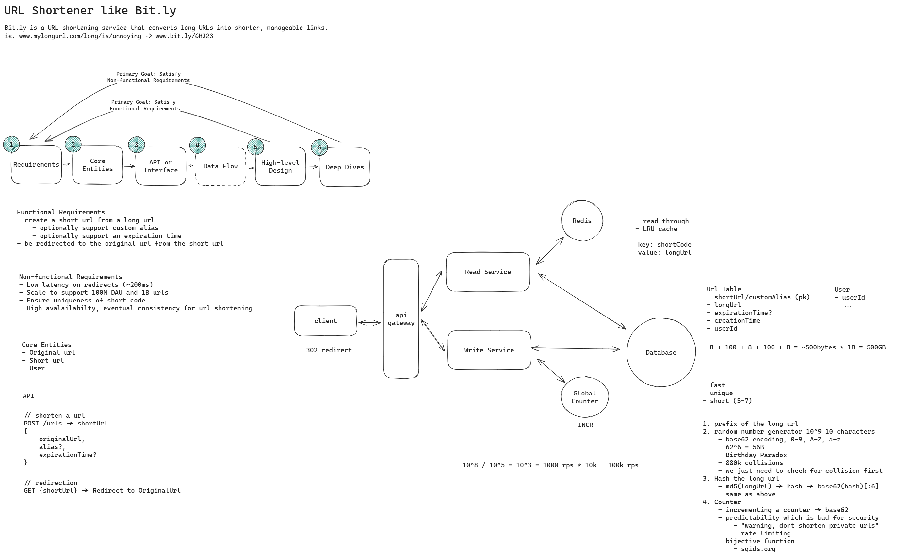

# Bit.ly (URL Shortener) — Revision Notes

> Source: hellointerview.com — Focus on final architecture & reasoning

---

## Requirements Recap

### Functional
1. Submit a long URL → receive a shortened URL (optional: custom alias, expiration date)
2. Visit shortened URL → redirect to original URL

### Non-Functional
1. **Uniqueness** — each short code maps to exactly one long URL
2. **Low latency** — redirection < 100ms
3. **High availability** — 99.99% (availability >> consistency)
4. **Scale** — 1B shortened URLs, 100M DAU
5. **Read-heavy** — ~1000 reads per 1 write

---

---

## Key Design Decisions & Reasoning

### 1. Short Code Generation — Counter + Base62 Encoding

| Approach | Verdict | Why |
|---|---|---|
| Long URL prefix | Bad | Not unique, not short enough |
| Hash function (e.g. MD5/SHA → truncate → Base62) | Great | Simple, but collisions possible after truncation; need retry logic |
| **Unique counter + Base62 encoding** | **Great (chosen)** | Guarantees uniqueness, simple, deterministic length |

**Why counter wins:** A monotonically increasing counter encoded in Base62 (a-z, A-Z, 0-9 = 62 chars) produces short, unique codes. 7 characters → 62^7 ≈ 3.5 trillion unique codes — more than enough for 1B URLs.

### 2. Redis as Global Counter — Why?

- When Write Service is horizontally scaled, all instances need a **single source of truth** for the counter.
- Redis is single-threaded, supports **atomic increment** (`INCR`), and is extremely fast.
- **Counter batching** reduces network overhead:
  1. Each Write Service instance requests a batch (e.g., 1000 values) from Redis.
  2. Redis atomically increments by 1000 and returns the batch start.
  3. Instance uses values locally until exhausted, then requests a new batch.
- **HA:** Redis Sentinel / Redis Cluster with automatic failover. If Redis loses a few counter values before replicating, that's acceptable — we only need uniqueness, not continuity. The DB `UNIQUE` constraint on `short_code` is the ultimate safety net.

### 3. Separate Read & Write Services — Why?

- Read-to-write ratio is ~1000:1.
- Separating into microservices allows **independent horizontal scaling** — spin up many more Read Service instances than Write Service instances.
- API Gateway routes `POST /urls` → Write Service, `GET /{short_code}` → Read Service.

### 4. Redis Cache for Reads — Why?

- Full table scan on 1B rows is too slow.
- Database index on `short_code` helps (B-tree → O(log n) lookup), but still hits disk.
- **Redis cache** (key: `short_code`, value: `original_url`) serves most reads from memory → sub-millisecond latency.
- Read path: check cache → cache miss → query DB → populate cache → respond.
- Cache TTL should be ≤ URL expiration time to avoid serving stale/expired URLs.

### 5. HTTP 302 (Found) over 301 — Why?

- **302** = temporary redirect → browser does NOT cache → every request hits our server.
- **301** = permanent redirect → browser caches → future requests skip our server.
- 302 is preferred because:
  - Allows updating or expiring links without browser cache issues.
  - Enables future analytics tracking (every click passes through the server).
  - Maintains system control over redirections.

### 6. Database Choice — Why Postgres (or any RDBMS)?

- After offloading reads to cache, DB write throughput is low (~1 write/sec for 100K new URLs/day).
- 1B rows × ~500 bytes/row = ~500 GB — fits on a single modern SSD.
- Any reasonable DB works (Postgres, MySQL, DynamoDB). Pick what you know.
- **HA strategies:** replication (primary-replica) or periodic backups.
- Sharding is possible but unlikely needed at this scale.

### 7. Multi-Region Scaling

- Allocate **disjoint counter ranges** per region (e.g., Region A: 0–1B, Region B: 1B–2B) to avoid cross-region coordination.
- Writes go to local region's Redis; reads served globally via distributed caches.

---

## Data Model

| Column | Type | Notes |
|---|---|---|
| short_code | VARCHAR (PK, UNIQUE) | Generated or custom alias |
| original_url | TEXT | The long URL |
| creationTime | TIMESTAMP | When created |
| expirationTime | TIMESTAMP (nullable) | Optional expiry |
| createdBy | VARCHAR/UUID | User reference |

---

## Quick-Reference: Request Flows

### Write Flow (POST /urls)
1. Client → API Gateway → Write Service
2. Validate long URL format
3. If custom alias: check uniqueness in DB
4. Else: get next counter from Redis (or local batch) → Base62 encode → short code
5. Insert `(short_code, original_url, expiration, ...)` into DB
6. Return `{ "short_url": "short.ly/abc123" }`

### Read Flow (GET /{short_code})
1. Client → API Gateway → Read Service
2. Look up `short_code` in Redis cache
3. Cache hit → return 302 redirect with `Location: <original_url>`
4. Cache miss → query DB → populate cache → return 302 redirect
5. If expired → return 410 Gone
6. If not found → return 404

---

## Common Interview Discussion Points

- **Predictable short codes:** Counter-based codes are sequential/guessable. If privacy matters, add a layer of indirection (hash the counter) or use a block cipher. In practice, URL shorteners shouldn't be used for private content.
- **Custom alias collisions:** Prefix generated codes with a reserved character, or use separate namespaces to prevent custom aliases from colliding with generated codes.
- **Expired URL cleanup:** Background job periodically deletes expired rows. Cache TTL ≤ expiration time handles stale cache entries.
- **Deduplication:** Most shorteners allow multiple short codes for the same long URL (different users may want separate expiration/analytics). Not required.
