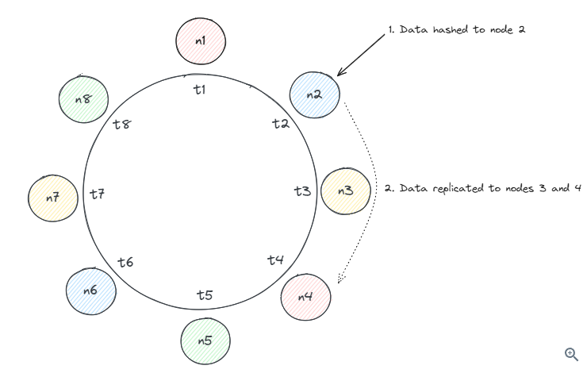
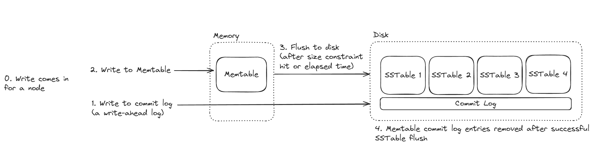

# Cassandra - Revision Notes

## 1. Overview

- Open-source, distributed **NoSQL** database by Apache (originally built by Facebook for inbox search)
- Partitioned **wide-column** storage model with **eventually consistent** semantics

---

## 2. Cassandra Basics

### 2.1 Data Model

- **Keyspace** — Top-level unit (like a "database" in RDBMS). Defines replication strategy and owns UDTs.
- **Table** — Lives in a keyspace; organizes data into rows with a schema defining columns and primary key.
- **Row** — Single record identified by a primary key.
- **Column** — Data storage unit with name, type, value, and timestamp metadata.
  - Wide-column: columns can vary per row (unlike RDBMS which requires every column per row).
  - Write conflicts resolved via **"last write wins"** using timestamps.
- Supports many types including user-defined types and JSON values.

### 2.2 Primary Key

- Every row is uniquely identified by a **primary key**.
- Consists of:
  - **Partition Key** — One or more columns determining which partition stores the row.
  - **Clustering Key** — Zero or more columns determining sorted order of rows within a partition.

```sql
-- Partition key: a, no clustering keys
PRIMARY KEY (a)

-- Partition key: a, clustering key: b
PRIMARY KEY ((a), b)

-- Composite partition key: a + b, clustering key: c
PRIMARY KEY ((a, b), c)

-- Partition key: a, clustering keys: b + c
PRIMARY KEY ((a), b, c)
```

---

## 3. Key Concepts

### 3.1 Partitioning

- Data partitioned across nodes using **consistent hashing**.
- Traditional hashing (`hash(value) % num_nodes`) has problems:
  1. Adding/removing nodes causes massive data re-mapping.
  2. Uneven load distribution possible.
- Consistent hashing maps values to a **ring** of integers; walk clockwise to find the responsible node.
  - Adding/removing a node only affects one adjacent node.
- **Vnodes (virtual nodes)**: Multiple positions on the ring map to physical nodes for even load distribution.
  - Bigger machines can own more vnodes.

### 3.2 Replication

- Partitions are replicated to multiple nodes for high availability.
- Replicas chosen by scanning **clockwise** from the hashed vnode; skips vnodes on the same physical node.
- **Replication Strategies:**
  - **NetworkTopologyStrategy** (recommended for production) — Data-center and rack aware Can specify how many replicas to store in each data centre.
  - **SimpleStrategy** — Simple clockwise scanning; good for testing.

```sql
-- SimpleStrategy with 3 replicas
ALTER KEYSPACE ks WITH REPLICATION = { 'class': 'SimpleStrategy', 'replication_factor': 3 };

-- NetworkTopologyStrategy: 3 replicas in dc1, 2 in dc2
ALTER KEYSPACE ks WITH REPLICATION = { 'class': 'NetworkTopologyStrategy', 'dc1': 3, 'dc2': 2 };
```

### 3.3 Consistency

- Subject to **CAP Theorem**; Cassandra lets users tune consistency vs. availability.
- **No ACID transactions** — only atomic/isolated writes at row level within a partition.
- Consistency levels range from **ONE** (single replica) to **ALL** (all replicas).
- **QUORUM** (`n/2 + 1`) — Guarantees write visibility on reads because at least one node overlaps between write and read sets.
  - Example: 3 replicas → quorum = 2; at least 1 node participates in both read and write.
- Default aim: **eventual consistency**.

### 3.4 Query Routing

- **Any node** can be a query **coordinator** (no single point of failure).
- All nodes know about other alive nodes via **gossip protocol**.
- Coordinator determines data location using consistent hashing + replication strategy, then routes to appropriate replicas.

## 7. Read/Write Model 

### 7.2 Write Path (Detailed)

1. **Request → Coordinator** — Any node can receive the request and become the coordinator.
2. **Coordinator finds replicas** — Uses partition key + hashing to determine which replica nodes store the data.
3. **Write sent to replicas in parallel** — Each replica does:
   - **Commit Log** (durability first) — Append to disk (sequential → very fast); ensures no data loss on crash.
   - **Memtable** (in-memory) — Stored in RAM for fast access. Memtable only stores the latest state pf the primary key row
4. **Ack based on consistency level** — Coordinator waits for responses:
   - `ONE` → 1 node ack
   - `QUORUM` → majority
   - `ALL` → all replicas
5. **Flush to SSTable (async)** — When memtable fills, flushed to disk as immutable SSTables.



**Why writes are fast:**
- Sequential disk writes (commit log)
- No read-before-write
- No locking across nodes

### 7.3 Read Path (Detailed)

Reads are more complex because data may be in memtable, across multiple SSTables, or across multiple nodes.

1. **Coordinator receives read request** — Any node can coordinate.
2. **Contacts replicas** — Based on consistency level; might query 1 or multiple replicas.
3. **Each replica checks multiple sources:**
   - **Memtable** — Latest data, in RAM.
   - **Row Cache** — Optional cache layer.
   - **Bloom Filter** — Fast probabilistic check; tells if an SSTable *might* contain the data.
   - **SSTables** — Reads from multiple files on disk if needed.
4. **Merge results** — SSTables are immutable, so data may exist in multiple places; Cassandra merges using **timestamps**.
5. **Read Repair** (optional but important) — If replicas return inconsistent data, coordinator fixes outdated replicas in background.

```
Client → Coordinator → Replica nodes
                           ↓
              Memtable + Cache + SSTables
                           ↓
                   Merge + Resolve
                           ↓
                     Return result
```

### 7.4 Consistency Levels

Controls the trade-off between **consistency** and **latency**:

| Level | Behavior |
|---|---|
| ONE | Fast, less consistent |
| QUORUM | Balanced |
| ALL | Strong consistency, slow |

**Strong consistency rule:**
$$R + W > RF$$
Where R = read consistency, W = write consistency, RF = replication factor.

### 7.5 Supporting Concepts (Quick Reference)

- **SSTables** — Immutable disk files, written sequentially, periodically compacted.
- **Compaction** — Merges SSTables, removes deleted/old data.
- **Tombstones** — Deletes are *marked*, not removed immediately.
- **Bloom Filters** — Avoid unnecessary disk reads via probabilistic checks.

### 7.6 Intuition

- **Writes** → dump quickly, organize later (append-only).
- **Reads** → gather pieces, reconcile (merge from multiple sources).
- No joins, no transactions like RDBMS.
- **Tunable consistency** is a core strength.

### 3.6 Gossip

- Peer-to-peer protocol for distributing cluster information (alive nodes, schema, etc.).
- Eliminates single points of failure — every node is aware of the full cluster.
- Uses **generation** (bootstrap timestamp) and **version** (logical clock) per node → forms a **vector clock** to ignore stale state.
- **Seed nodes** — Designated bootstrap/gossip hotspots ensuring information reaches the entire cluster. Nodes have some bias to gossip with the seed nodes

### 3.7 Fault Tolerance

- **Phi Accrual Failure Detector** — Each node independently decides if another node is available.
- Unresponsive nodes are "convicted" and removed from write routing; re-enter when heartbeating resumes.
- Nodes never considered truly "down" unless manually decommissioned (prevents unnecessary rebalancing).
- **Hinted Handoffs:**
  - When a target node is offline, the coordinator stores the write as a "hint."
  - When the offline node recovers, hints are sent to it.
  - Short-term mechanism; long-offline nodes undergo read repairs or rebuild.

---

## 4. Data Modeling

- Data modeling is **query-driven** (not entity-relationship-driven like RDBMS).
- No JOINs, no foreign keys, no referential integrity.
- Favor **denormalization** — duplicate data across tables to support access patterns.
- Key considerations:
  - **Partition Key** — What determines the partition.
  - **Partition Size** — Extreme case size; can it grow indefinitely?
  - **Clustering Key** — How data should be sorted.
  - **Data Denormalization** — Duplicating data across tables for efficient queries.

### 4.1 Example: Discord Messages

**Initial schema:**
```sql
CREATE TABLE messages (
  channel_id bigint,
  message_id bigint,  -- Snowflake ID (chronologically sortable UUID)
  author_id bigint,
  content text,
  PRIMARY KEY (channel_id, message_id)
) WITH CLUSTERING ORDER BY (message_id DESC);
```
- Single partition per channel; efficient single-partition queries.
- Snowflake IDs for message id avoid timestamp collisions.

**Problem:** Busy channels → large partitions → performance issues.

**Solution — Bucketing:**
```sql
CREATE TABLE messages (
  channel_id bigint,
  bucket int,          -- 10-day time window
  message_id bigint,
  author_id bigint,
  content text,
  PRIMARY KEY ((channel_id, bucket), message_id)
) WITH CLUSTERING ORDER BY (message_id DESC);
```
- Bounds partition size; prevents indefinite growth.
- Most queries still hit a single partition (recent bucket).

---


## 6. When to Use Cassandra

### 6.1 Good Fit

- Systems prioritizing **availability over consistency**
- **High write throughput** (LSM tree optimized)
- **High scalability** needs
- Flexible / sparse schemas (wide-column)
- Clear, well-defined **access patterns**

### 6.2 Poor Fit

- Systems requiring **strict consistency**
- Advanced query patterns: multi-table JOINs, ad-hoc aggregations
- Complex transactional requirements (no ACID)

---

---

## 8. Key Takeaways

| Feature | Detail |
|---|---|
| Type | Distributed NoSQL, wide-column |
| Partitioning | Consistent hashing with vnodes |
| Replication | Configurable (SimpleStrategy / NetworkTopologyStrategy) |
| Consistency | Tunable (ONE → QUORUM → ALL); eventual by default |
| Storage | LSM tree (Commit Log → Memtable → SSTable) |
| Writes | Append-only, very fast |
| Reads | Memtable → Bloom filter → SSTables |
| Fault Tolerance | Phi Accrual Failure Detector + Hinted Handoffs |
| Communication | Gossip protocol (peer-to-peer) |
| Data Modeling | Query-driven, denormalized |
