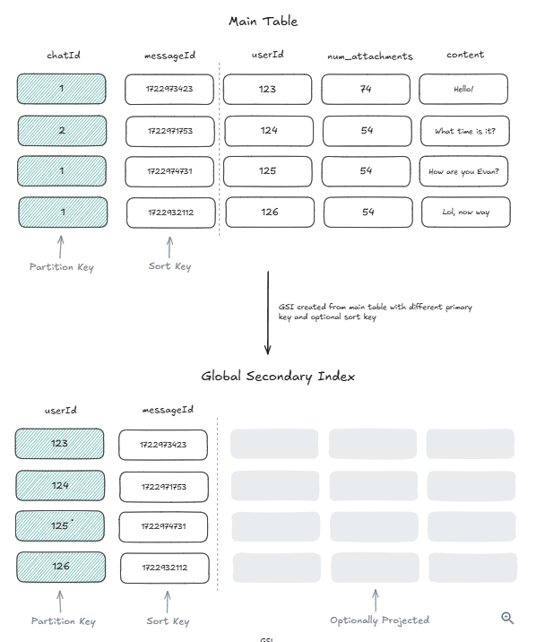
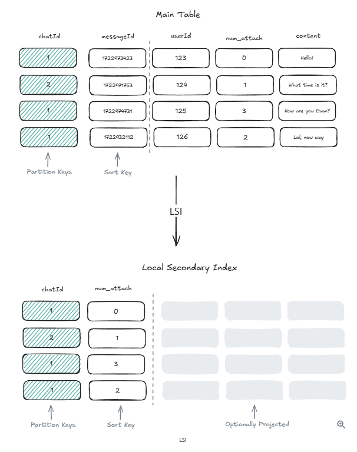
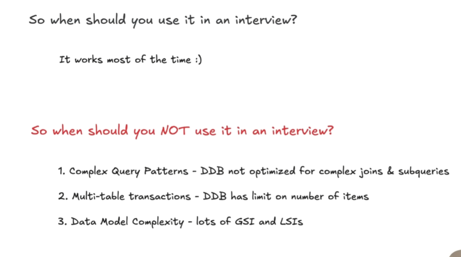

# DynamoDB - Revision Notes

Fully-managed, highly scalable, key-value NoSQL database service by AWS.

- **Fully-Managed** — AWS handles hardware provisioning, configuration, patching, and scaling.
- **Highly Scalable** — Automatically scales up/down with no downtime.
- **Key-Value** — NoSQL model with flexible data storage and retrieval.
- Supports transactions (up to 100 items across multiple tables) — "NoSQL means no transactions" no longer applies.
- Not open-source — proprietary internals.

---

## 1. The Data Model

- **Tables** — Top-level structure, defined by a mandatory primary key.
- **Items** — Rows; each must have a primary key, max 400KB including all attributes.
- **Attributes** — Key-value pairs (scalars, sets, nested structures). Items in the same table can have different attributes.
- **Schema-less** — No upfront schema required; new attributes can be added anytime. Requires app-level validation.
- Uses JSON as transport format; actual storage format is proprietary.

### 1.1 Partition Key and Sort Key

- **Partition Key (PK)** — Hashed to determine the physical partition/storage node.
- **Sort Key (SK)** — Optional; combined with PK forms a composite primary key. Enables range queries and sorting within a partition.
- Choose PK to optimize for the most common query patterns and keep data evenly distributed.
- For sort keys, prefer monotonically increasing IDs (UUID v7, Snowflake IDs, ULID) over timestamps to guarantee uniqueness.

**Under the hood:**

- **Hash Partitioning** — PK is hashed; a request router consults a partition metadata service to map to the correct storage node (centralized partition map, not peer-to-peer hash ring).
- **B-trees for Sort Keys** — Within each partition, items are organized in a B-tree indexed by SK.
- **Composite Key Operations** — PK hash finds the node → SK traverses the B-tree.
- Partition metadata service handles automatic splitting and merging as data grows.

### 1.2 Secondary Indexes

| | GSI (Global Secondary Index) | LSI (Local Secondary Index) |
|---|---|---|
| Definition | Different partition key than main table | Same partition key, different sort key |
| Storage | Separate physical partitions | Co-located with base table |
| When to Use | Query on attributes not in primary key | Additional sort keys within same partition |
| Size Limit | No size restrictions | 10 GB per partition key |
| Consistency | Eventually consistent only | Supports eventual and strong consistency |
| Creation | Add/remove anytime | Must define at table creation; cannot remove |

**Under the hood:**

- GSIs are separate internal tables with their own partition scheme; updated **asynchronously**.
- LSIs are co-located with main table partitions with a separate B-tree; updated **synchronously**.
- DynamoDB automatically propagates changes to all secondary indexes.
- When a query uses a secondary index, DynamoDB routes the query to the appropriate index table (for GSIs) or B Tree (for LSIs).

 

### 1.3 Accessing Data

- **Query** — Retrieves items by primary key or secondary index. Efficient, reads only matching items. Supports range queries on Sort Key.
- **Scan** — Reads every item in a table/index. Need to be used for querying using Non Primary Non GSI attribte Inefficient for large datasets — **avoid if possible**.
- Supports **PartiQL** (SQL-compatible syntax) — convenience layer over native operations.
- Reads return the entire item by default. `Projections` reduces network bandwidth but **not** RCU cost (full item is still read from storage).
- **Normalize data** to avoid reading oversized items (e.g., separate reviews from business details).

---

## 2. CAP Theorem

- **Consistency is per-request**, not per-table — set `ConsistentRead=true` on individual reads.

| | Strongly Consistent | Eventually Consistent (Default) |
|---|---|---|
| Read from | Leader node only | Any of 3 replicas |
| Behavior | Reflects all prior successful writes | May not see most recent write |
| Cost | (2× cost) | |
| Latency | Slightly higher | Lower |
| GSI Support | No — only base table and LSIs | Yes |

- Supports **ACID transactions** (limit up to 100 items across multiple tables).

---

## 3. Architecture and Scalability

### 3.1 Scalability

- **Auto-sharding** — partitions automatically split/merge when reaching capacity (size or throughput).
- **Hash-based partitioning** ensures even distribution across nodes.
- **Global Tables** — real-time active-active replication across AWS regions for low-latency global access.
- Multi-AZ integration within each region for redundancy.

### 3.2 Fault Tolerance and Availability

- Data automatically replicated across **3 Availability Zones** (not configurable).
- Each partition: **1 leader + 2 followers** managed by AWS.
- Uses **Multi-Paxos consensus** with leader-based replication.
- Writes: leader generates WAL entry → sends to peers → acknowledged after **quorum (2 of 3)** persists.
- Strongly consistent reads → routed to leader.
- Eventually consistent reads → any replica can serve.

---

## 4. Security

- **Encryption at rest** — enabled by default.
- **Encryption in transit** — TLS enforced for all API calls.

---

## 5. Pricing Model

- **On-Demand** — charges per request; best for unpredictable workloads.
- **Provisioned Capacity** — specify RCU/WCU, billed hourly; cost-effective for predictable workloads.

---

## 6. Advanced Features

### 6.1 DAX (DynamoDB Accelerator)

- Purpose-built **in-memory cache** — microsecond response times for read-heavy workloads.
- **Read-through and write-through** cache.
- Swap DynamoDB client for DAX client SDK (Java, .NET, Node.js, Python, Go) — API compatible.
- Two caches: **item cache** (GetItem/BatchGetItem) and **query cache** (Query/Scan) — both always active.
- **Does NOT cache strongly consistent reads** — passes them directly to DynamoDB.
- Caveat: writes bypassing DAX can leave stale cache entries until TTL/eviction.

### 6.2 DynamoDB Streams (Change Data Capture)

- Captures insert, update, delete events as stream records in real-time.
- Use cases:
  - **Elasticsearch sync** — keep search index consistent with DynamoDB data.
  - **Change notifications** — trigger Lambda functions on data changes.

---

## 7. DynamoDB in an Interview

### 7.1 When to Use

- Highly scalable, durable, single-digit ms latency (microsecond with DAX).
- Supports transactions, built-in caching (DAX), CDC (Streams).
- Good default for most persistence needs if interviewer allows AWS services.

### 7.2 Limitations

1. **Cost** — high-volume workloads (100K+ writes/s) can get expensive.
2. **Complex queries** — no joins or ad-hoc aggregations; limited vs SQL.
3. **Data modeling** — requires careful design; heavy GSI/LSI use may signal a relational DB is better.
4. **Vendor lock-in** — tied to AWS; some interviewers prefer open-source/vendor-neutral solutions.

### 7.3 DynamoDB vs Cassandra (Interview Context)

- Cassandra is **write-optimized** (LSM trees); DynamoDB is **read-optimized** (B-trees).
- Cassandra has weaker secondary index support.
- DynamoDB has built-in CDC (Streams); Cassandra's CDC support is more limited.
- Often used interchangeably in interviews for high-write scenarios.
