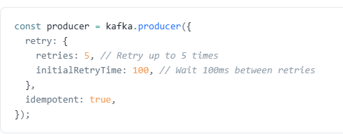
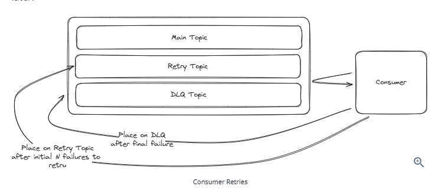

# Kafka - Revision Notes

Apache Kafka is an open-source **distributed event streaming platform** used as a message queue or stream processing system. Used by 80% of Fortune 100. Excels at high performance, scalability, and durability.

---

## 1. Core Concepts

### 1.1 Producers & Consumers
- **Producer**: Process that writes messages to Kafka topics
- **Consumer**: Process that reads messages from Kafka topics (pull-based model)
- Consumers actively poll brokers for new messages at intervals they control
- Pull-based design allows consumers to control consumption rate, simplifies failure handling, and enables efficient batching

### 1.2 Topics & Partitions
- **Topic**: Logical grouping of partitions; used to publish/subscribe to data. Always multi-producer
- **Partition**: Ordered, immutable, append-only log of messages. Physical unit of parallelism
- A topic can have multiple partitions spread across different brokers
- Each message in a partition gets a unique **offset** (sequential position identifier)

### 1.3 Brokers & Clusters
- **Broker**: Individual server (physical or virtual) that stores data and serves clients
- **Cluster**: Collection of multiple brokers
- More brokers = more storage capacity and client throughput

### 1.4 Consumer Groups
- Consumers are grouped into **consumer groups**
- Each partition is assigned to exactly one consumer within a group
- Enables parallel processing while ensuring each message is processed once per group

---

## 2. Message Structure

A message (record) has four fields (all optional):
| Field | Purpose |
|-------|---------|
| **Value** | The payload |
| **Key** | Determines partition assignment |
| **Timestamp** | When message was created/ingested |
| **Headers** | Key-value metadata pairs |

---

## 3. How Kafka Works

### 3.1 Partition Assignment
1. **Key provided**: `partition = hash(key) % num_partitions` (murmur2 hash by default)
2. **No key**: Modern clients use a "sticky" partitioner — batches to same partition, then rotates for roughly even distribution

### 3.2 Append-Only Log Benefits
- **Immutability**: Messages cannot be altered once written; simplifies replication and recovery
- **Efficiency**: Minimizes disk seek times (only appending)
- **Scalability**: Easy horizontal scaling via more partitions

### 3.3 Replication (Leader-Follower Model)
1. Each partition has one **leader replica** handling all writes (and by default reads)
2. **Follower replicas** on different brokers passively replicate from leader
3. Followers continuously sync; a fully-synced follower can be promoted if leader fails
4. **Controller** monitors broker health, manages leadership and replication dynamics
- Kafka 2.4+ supports consumer reads from follower replicas for latency optimization

### 3.4 Delivery Semantics
- **Default**: At-least-once delivery
- If consumer crashes after processing but before committing offset → message gets reprocessed
- **Exactly-once**: Possible with idempotent producers + transactional APIs (requires additional config)

---

## 4. When to Use Kafka

### 4.1 As a Message Queue
- Asynchronous processing (e.g., YouTube video transcoding)
- Ordered message processing (e.g., virtual waiting queue in Ticketmaster)
- Decoupling producers and consumers for independent scaling

### 4.2 As a Stream
- Real-time continuous processing (e.g., Ad Click Aggregator)
- Multiple consumer groups reading the same data independently (e.g., FB Live Comments pub/sub)
- Log retained and replayable from any point

---

## 5. Scalability

### 5.1 Single Broker Limits
- ~1TB storage, ~100K messages/second (varies by message size and hardware)
- Keep messages under **1MB** for optimal performance

### 5.2 Anti-Pattern
- Don't store large blobs (e.g., videos) in Kafka. Store in S3/blob storage and put a pointer message in Kafka

### 5.3 Scaling Strategies
1. **Horizontal scaling**: Add more brokers + ensure topics have enough partitions
2. **Partitioning strategy**: Choose keys for even distribution across partitions

### 5.4 Handling Hot Partitions
1. **No key (default partitioning)**: Even distribution, but lose ordering guarantees
2. **Random salting**: Append random value to key; complicates downstream aggregation
3. **Compound key**: Combine primary key with another attribute (e.g., ad_id + region)
4. **Back pressure**: Slow down the producer when partition lag is too high

---

## 6. Fault Tolerance & Durability

### 6.1 Producer Acknowledgments (`acks`)
| Setting | Guarantee |
|---------|-----------|
| `acks=all` | Acknowledged only when **all in-sync replicas** receive it (strongest durability) |
| `acks=1` | Acknowledged when **leader** receives it (balance latency vs reliability) |

### 6.2 Replication Factor
- Common setting: **3** (1 leader + 2 followers)
- If one broker fails, data remains on other two; follower promoted to leader

### 6.3 Consumer Failure Handling
1. **Offset management**: Consumers commit offsets after processing; on restart, resume from last committed offset
2. **Rebalancing**: If a consumer in a group fails, Kafka redistributes its partitions to remaining consumers

### 6.4 Key Insight
> "Kafka is always available, sometimes consistent."
> Consumer failure is far more realistic than Kafka going down.

### 6.5 Offset Commit Strategy
- Don't commit until processing is confirmed (e.g., ensure HTML stored before committing in a web crawler)
- Keep consumer work minimal to reduce reprocessing risk on failure
- `ack` (producer term) ≠ `commit` (consumer term)

---

## 7. Handling Retries & Errors

### 7.1 Producer Retries
- Configure automatic retries with backoff
- Enable **idempotent producer** mode to avoid duplicates on retry

### 7.2 Consumer Retries
- Kafka has **no built-in consumer retry** (unlike AWS SQS)
- Common pattern: failed messages → **Retry Topic** → separate consumer retries
- After max retries → move to **Dead Letter Queue (DLQ)** for investigation
- Consider SQS if built-in retry/DLQ support is critical

---

## 8. Performance Optimizations

1. **Batch messages**: Send multiple messages in a single `send()` or `sendBatch()` call (batchSize , maxTime)
2. **Compression**: Use GZIP, Snappy, or LZ4 to reduce message size and improve throughput
3. **Partition key selection**: Maximize parallelism with even distribution across partitions

---

## 9. Retention Policies

- Configured via `retention.ms` (time-based) and `retention.bytes` (size-based)
- **Default**: 7 days
- Longer retention → higher storage costs; plan accordingly

---

## 10. Quick Reference Summary

| Aspect | Key Point |
|--------|-----------|
| **What** | Distributed event streaming platform (message queue or stream) |
| **Scaling** | Add brokers + partitions; choose good partition keys |
| **Durability** | Replication factor (typically 3) + `acks=all` |
| **Ordering** | Guaranteed within a partition only |
| **Delivery** | At-least-once by default; exactly-once with extra config |
| **Consumer groups** | Each partition → one consumer per group |
| **Retention** | Default 7 days; configurable |
| **Anti-pattern** | Don't store large blobs; use pointers to S3/blob storage |
| **Hot partitions** | Salting, compound keys, or remove key for even distribution |
| **Retries** | Producer: built-in with idempotency. Consumer: manual via retry topics + DLQ |
